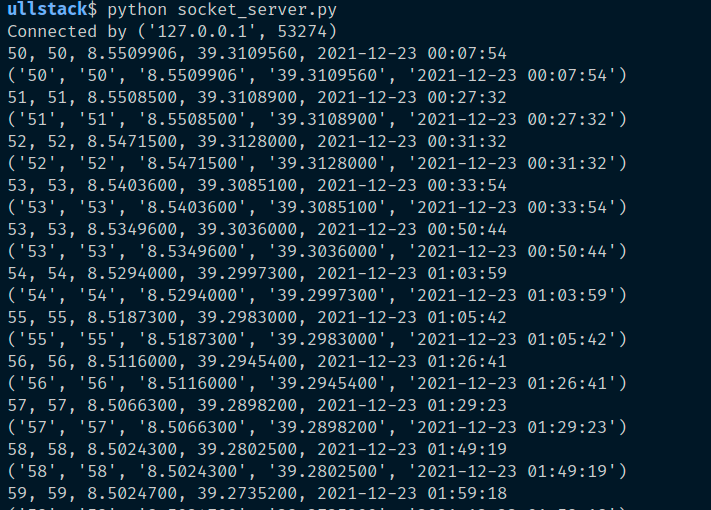
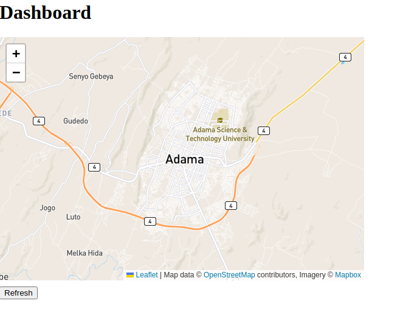
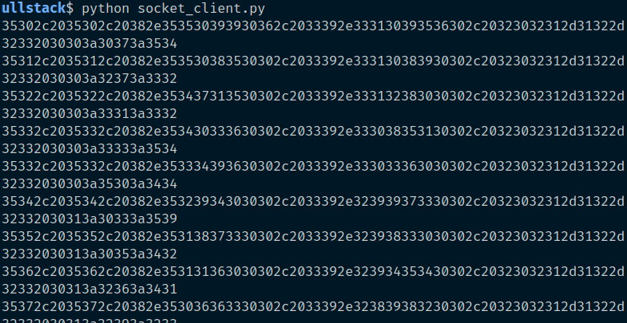
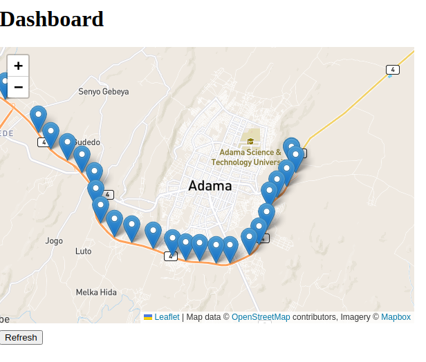
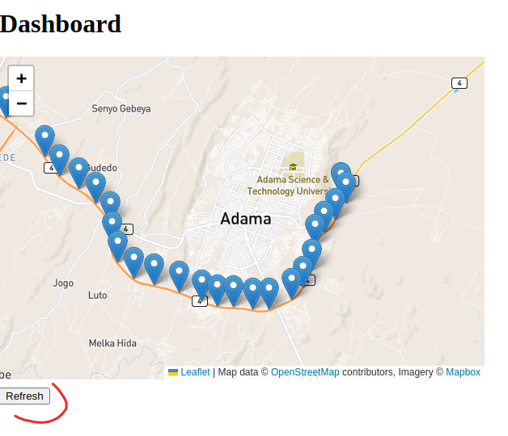
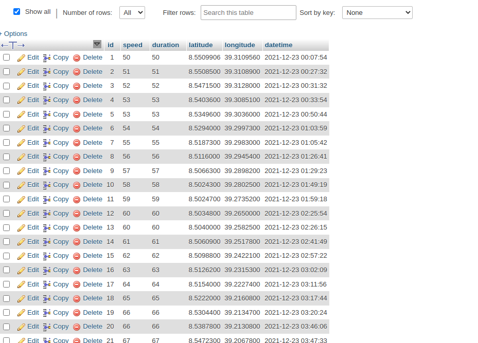

# Récupérer le projet

```bash

$ git clone git@github.com:kayode-adechinan/project_dev_fullstack.git

```

# Configurer la base de données mysql

On peut configurer la base de données en changeant les valeurs suivantes:

```
DB_USER = "root"
DB_PASSWORD = ""
DB_HOST = "127.0.0.1"
DB_NAME = "coordinates_db"
```

# Installer les dépendances du projet

```bash
$ pip install -r requirements.txt
```

# initialiser la base de données

```bash

$ python init_db.py

```

# Démarrer le server socket

```bash

$ python socket_server.py

```

Au départ dans la ligne de commande, on observe rien. Mais plutard, lorsque le serveur sera entrain de recevoir et décoder les données on pourra observer ce rendu:



# Démarrer le serveur web pour accéder à la carte

On peut par exemple démarrer le serveur web d'abord avant de démarrer l'envoi des données. Et se servir du bouton refresh pour raffraichir la carte avec de l'ajax.

```bash

$ python app.py

```

## Ouvrir ensuite le navigateur à cette page

http://localhost:5000/

- La carte utilise la librairie leaflet.js. Google map étant devenu payant.

En dessous de la carte se trouve un bouton **"refresh"** permettant de rafraichir la carte à l'aide d'une requête ajax dont le code se trouve dans le fichier "static/js/app.js"

Ce même fichier fichier contient une fonction **"autoRefresh"** qu'on peut configurer au besoin pour rafraichir la carte par interval d'une seconde.

Lorsqu'il n'y a pas encore de données, la carte ressemble à ceci:



# Démarrer le client pour l'envoie de données

```bash

$ python socket_client.py

```

Lorsque le client est entrain d'envoyer des données on observe ceci:



# Raffraichir la carte avec Ajax

Dans le navigateur, utiliser le bouton "refresh" pour raffraichir la carte





# Les données en base de données



# Note

Il faut une connection internet active pour le projet puisse télécharger les fichiers cdn des librairies suivantes

- leaflet.css
- leaflet.js
- axios.js
